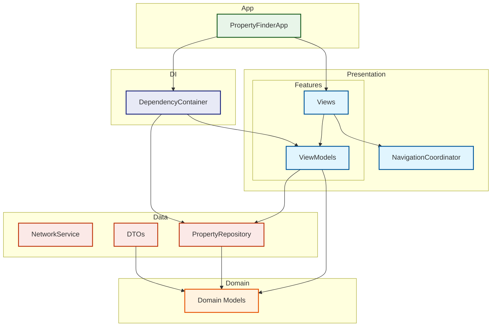

# Property Finder

A SwiftUI test assignment that demonstrates modern iOS development practices through a property browsing application.

## Requirements Implementation

### Property List Screen ✓
Required features implemented (see [PropertyList.swift](PropertyFinder/Presentation/Features/PropertyList/Views/PropertyList/PropertyList.swift)):
- Property listing with name, type, city and rating
- Thumbnail images with async loading and placeholders
- Toggle between list and map views
- Loading states and error handling

### Property Detail Screen ✓
Required features implemented (see [PropertyDetailView.swift](PropertyFinder/Presentation/Features/PropertyDetail/Views/PropertyDetailView.swift)):
- Full property information display
- Address details (address1, address2, city, country)
- Property description with "Read more" functionality
- Directions
- Image carousel
- Additional sections (Check-in, House Rules, Reviews, Location)

## Technical Implementation

### Architecture
The app follows Clean Architecture principles with MVVM pattern:

### Testing
Comprehensive test coverage including:

#### ViewModel Tests ([PropertyDetailViewModelTests.swift](PropertyFinderTests/Presentation/PropertyDetails/PropertyDetailViewModelTests.swift))
- Success scenarios
- Error handling
- Loading states
- State management
- Data flow

#### Repository Tests ([PropertyRepositoryTests.swift](PropertyFinderTests/Data/Repository/PropertyRepositoryTests.swift))
- Network error handling
- Data mapping
- API integration
- Mock responses
- Call counting

#### Network Tests ([NetworkServiceTests.swift](PropertyFinderTests/Data/Network/NetworkServiceTests.swift))
- API endpoint testing
- Response parsing
- Error scenarios
- HTTP status handling
- Mock URL Protocol

#### Navigation Tests ([NavigationCoordinatorTests.swift](PropertyFinderTests/Presentation/Navigation/NavigationCoordinatorTests.swift))
- Route handling
- Navigation stack management
- Back navigation
- Deep linking

#### ViewState Tests ([ViewStateTests.swift](PropertyFinderTests/Presentation/Common/ViewStateTests.swift))
- Loading state
- Error state
- Empty state
- Data loaded state
- State transitions

All tests follow the Given-When-Then pattern and use mocking for dependencies.

## Technical Highlights
- SwiftUI for modern UI development
- Async/await for concurrency
- Dependency Injection for testability
- Protocol-oriented design
- MVVM architecture
- Comprehensive error handling
- Unit test coverage

